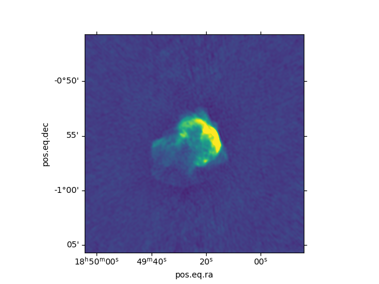

# 3C391: A Storage4PUNCH-REANA use-case for data reduction and analysis
<!-- ABOUT THE PROJECT -->
In this use-case, we demonstrate the use of REANA for the reduction and data analysis of radio interferometric data, along with the integration between Storage4PUNCH and REANA. 

We use the standard data reduction software [CASA](https://casadocs.readthedocs.io/en/v6.2.0/notebooks/usingcasa.html#) and [wsclean](https://wsclean.readthedocs.io/en/latest/) for calibration and imaging of raw measurement set obtained from Karl G. Jansky Very Large Array (VLA). The sample dataset is a supernova remnant [3C391](http://simbad.u-strasbg.fr/simbad/sim-id?Ident=3C+391&NbIdent=1&Radius=2&Radius.unit=arcmin&submit=submit+id) observed at 4.5 GHz. Refer to the NRAO [casa-guide](https://casaguides.nrao.edu/index.php?title=VLA_Continuum_Tutorial_3C391-CASA6.4.1) to get more details for the reduction and analysis procedure. The resultant images are Flexible image transfer system (fits) files which can be viewed using software like CASA and ds9. We then use Python packages of 'matplotlib' and 'astropy' to create 'png' images from these fits files. In the last step, a source catalogue is generated using [PyBDSF](https://pybdsf.readthedocs.io/en/latest/index.html) to get the coordinates, flux measurements, sizes and other common properties for sources in the image. All the software and their dependencies used here are stored in docker files that are accessed via an environment variable in the 'yaml' file.

Along with the different codes for analysis, this github page contains the yaml file which has the instructions to run the REANA instance. The user can modify the codes as per their preferences. Also, please refer to the following [example](https://github.com/reanahub/reana-demo-helloworld) for instructions to create a general 'yaml' file and run a basic REANA instance. 

The measurement dataset is uploaded on the Storage4PUNCH archive and can be accessed via the storage client 'davix' and used for running in the REANA instance. The results are also uploaded to Storage4PUNCH using 'davix' commands. The davix commands for the same are stored in the file storage4punch_to_REANA.sh and REANA_to_storage4punch.sh respectively. 

_Description of files:_
1) reana.yaml-- yaml setup file for REANA
2) pipeline_casa.py-- pipeline for calibration and imaging of raw dataset using CASA (generates a calibrated dataset and final fits image)
3) plot_casa_image.py-- Generate png image from fits file using 'matplotlib' and 'astropy' (CASA imaging)
4) wsclean.sh-- Imaging of calibrated dataset using WSCLEAN (uses the calibrated dataset generated from CASA pipeline for imaging)
5) plot_wsclean_image.py-- Generate png image from fits file using 'matplotlib' and 'astropy' (WSCLEAN imaging)
6) pybdsf.py-- Generate the source catalog from the fits image using PyBDSF
7) storage4punch_to_REANA.sh-- command to download data from storage4punch to REANA
8) REANA_to_storage4punch.sh-- command to upload results to storage4punch from REANA
9) 3c391_ctm_mosaic_10s_spw0.ms.tgz1-- Compressed measurement set (to be stored on Storage4PUNCH)
   Download from [here](http://casa.nrao.edu/Data/EVLA/3C391/3c391_ctm_mosaic_10s_spw0.ms.tgz)

Follow this step-by-step guide to complete the tutorial:

Connect to the Storage4PUNCH using oidc agent, see instructions [here](https://intra.punch4nfdi.de/?md=/docs/TA2/WP1/StoragePrototyping.md)
```sh
eval `oidc-agent`
oidc-add <ACCOUNT-Name>
oidc-add <ACCOUNT-Name>
# replace <ACCOUNT-Name> with the name that you choose during setup
export BEARER_TOKEN=$(oidc-token <ACCOUNT-Name>)
# create user/directory 
davix-mkdir -k -H "Authorization: Bearer ${BEARER_TOKEN}" https://dcache-desy-webdav.desy.de:2880//pnfs/desy.de/punch/mukul/3c391
# upload data in Storage4PUNCH
davix-put -k 3c391_ctm_mosaic_10s_spw0.ms.tgz1 -H "Authorization: Bearer ${BEARER_TOKEN}" https://dcache-desy-webdav.desy.de:2880//pnfs/desy.de/punch/mukul/3c391/3c391_ctm_mosaic_10s_spw0.ms.tgz1 3c391_ctm_mosaic_10s_spw0.ms.tgz1
#check the data in Storage4PUNCH
davix-ls -k -l -H "Authorization: Bearer ${BEARER_TOKEN}" https://dcache-desy-webdav.desy.de:2880//pnfs/desy.de/punch/user/username
```
For more details on Storage4PUNCH and commands follow the PUNCH4NDI TA2 page for [StoragePrototyping](https://intra.punch4nfdi.de/?md=/docs/TA2/WP1/StoragePrototyping.md)

Start the reana client on the local machine
```sh
virtualenv ~/.virtualenvs/reana
source ~/.virtualenvs/reana/bin/activate
#start the reana instance at AIP
export REANA_SERVER_URL=https://reana-p4n.aip.de
export REANA_ACCESS_TOKEN=XXXXXXXXXXXXX
# generate key to connect Storage4PUNCH with reana
reana-client secrets-add --env BEARER_TOKEN=$BEARER_TOKEN
#create a new workflow
reana-client create -n myanalysis
export REANA_WORKON=myanalysis
# update and upload input codes and workflow to the workspace
reana-client upload
# start computational workflow
reana-client start
# After completion check the results in Storage4PUNCH
# or download the files on the local computer
```
For more details on installing and running reana, go to the following [page](https://reanahub.io/) and refer to some examples.

<!-- Final Image -->
<br />
<div align="center">
  <a href="https://github.com/othneildrew/Best-README-Template">
    
  </a>
  <h3 align="center">Result image: Supernova remnant 3C391 (wsclean image)</h3>
   
<div align="left">
The above approach was adopted to generate radio fits files and source catalogs for 12 targets (compact radio galaxies) observed with the VLA at frequencies ranging from 1 to 8GHz (121 images). The results will be combined with observations using the GMRT to produce SEDs for these 12 compact radio galaxies with seamless coverage from 0.1 to 8 GHz. Results will be published in (Mhaskey et al, in preparation)
