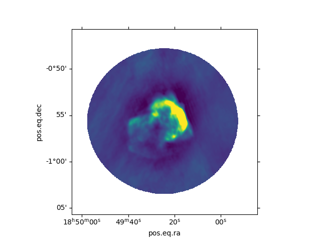

# reana_demo_radio

<!-- ABOUT THE PROJECT -->
## About The Project

In this test case we demonstrate the use of REANA for reduction and data analysis of radio interferometric data. We use the standard data reduction software the CASA and Wsclean for calibration and imaging of raw measurement set obtained from VLA. The sample dataset is a supernova remnant observed at xx GHz. Refer to the following pages to get more details for the reduction and analysis procedure. For casa-- link, for wsclean-- link.  

The resultant images are Flexible image transfer system (fits) files which can be viewed using softwares  like casa and ds9. We then use python packages of matplotlib and astropy to create 'png' images from these fits files (link). In the last step a source finder catalog called PyBdsf is used to get the coordinates, flux measurements, sizes and other common properties for sources in the image. All the softwares and their dependencies used here are stored in a docker file that is acessed via an environment variable in the yaml file.

Along with the different codes for analysis, this github page contains the yaml file that has the instructions to run the REANA instance. The user can modify the codes as per their own preferences. Also, please refer to the following example for instructions to create a general yaml file and run a basic REANA instance (link). 

The measurement dataset is uploaded on the storage4punch archive and can be accessed via davix and used for running  the REANA instance. The results are also  uploaded to storage4punch using davix. The files upload_davix and download_davix are used for this. For  general davix commands and how to use it to connect to REANA refer the following file (storage4punch--reana.txt).

_Description of files:_
1) reana.yaml-- yaml setup file for REANA
2) pipeline_casa.py-- calibration and imaging of raw dataset using CASA
3) plot_casa_image.py-- Generate png image from fits file (CASA imaging)
4) wsclean.sh-- Imaging of calibrated dataset using WSCLEAN
5) plot_wsclean_image.py-- Generate png image from fits file (WSCLEAN imaging)
6) pybdsf.py-- Generate the source catalog from the fits image 
7) storage4punch_to_REANA.sh-- command to download data from storage4punch to REANA
8) REANA_to_storage4punch.sh-- command to upload results to storage4punch from REANA
9) 3c391_ctm_mosaic_10s_spw0.ms.tgz1-- Compressed measurement set (to be stored on storage4punch)
   Download from [here](http://casa.nrao.edu/Data/EVLA/3C391/3c391_ctm_mosaic_10s_spw0.ms.tgz)

Follow this step by step guide to complete the tutorial:
*** Commands with instructions and comments with #)***

#connect to the storage4punch using oidc agent (see instructions here)
```sh
eval `oidc-agent`
oidc-add <ACCOUNT-Name>
oidc-add <ACCOUNT-Name>
# replace <ACCOUNT-Name> with the name that you choose during setup
export BEARER_TOKEN=$(oidc-token <ACCOUNT-Name>)
# create user/directory 
davix-mkdir -k -H "Authorization: Bearer ${BEARER_TOKEN}" https://dcache-desy-webdav.desy.de:2880//pnfs/desy.de/punch/mukul/3c391
# upload data in storage4punch
davix-put -k 3c391_ctm_mosaic_10s_spw0.ms.tgz1 -H "Authorization: Bearer ${BEARER_TOKEN}" https://dcache-desy-webdav.desy.de:2880//pnfs/desy.de/punch/mukul/3c391/3c391_ctm_mosaic_10s_spw0.ms.tgz1 3c391_ctm_mosaic_10s_spw0.ms.tgz1
#check the data in storage4punch
davix-ls -k -l -H "Authorization: Bearer ${BEARER_TOKEN}" https://dcache-desy-webdav.desy.de:2880//pnfs/desy.de/punch/user/username
```
For more details on storage4punch and commands follow the PUNCH4NDI TA2 page for [StoragePrototyping](https://intra.punch4nfdi.de/?md=/docs/TA2/WP1/StoragePrototyping.md)

start the reana client on the local machine
```sh
virtualenv ~/.virtualenvs/reana
source ~/.virtualenvs/reana/bin/activate
#start the reana instance at AIP
export REANA_SERVER_URL=https://reana-p4n.aip.de
export REANA_ACCESS_TOKEN=XXXXXXXXXXXXX
# generate key to connect storage4punch with reana
reana-client secrets-add --env BEARER_TOKEN=$BEARER_TOKEN
#create a new workflow
reana-client create -n myanalysis
export REANA_WORKON=myanalysis
# update and upload input codes and workflow to the workspace
reana-client upload
# start computational workflow
reana-client start
# After completion check the results in storage4punch
# or download the files on the local computer
```
For more details on installing and running reana, go to the following [page](https://reanahub.io/) and refer to some examples.

<!-- Final Image -->
<br />
<div align="center">
  <a href="https://github.com/othneildrew/Best-README-Template">
    
  </a>
  <h3 align="center">Supernova remnant 3C391</h3>


<div align="left">
#The above approach was adopted to generate radio fits files and source catalogs for 12 targets (compact radio galaxies) observed with the VLA at frequencies ranging from 1 to 8GHz (xx files in total). The results will be combined with observations using the GMRT to produce SEDs for these 12 compact radio galaxies with seamless coverage from 0.1 to 8 GHz. Results will be published in (Mhaskey et al, in preparation)
